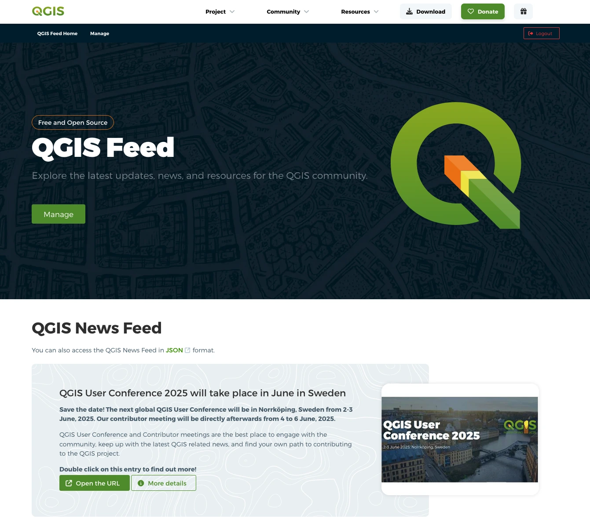
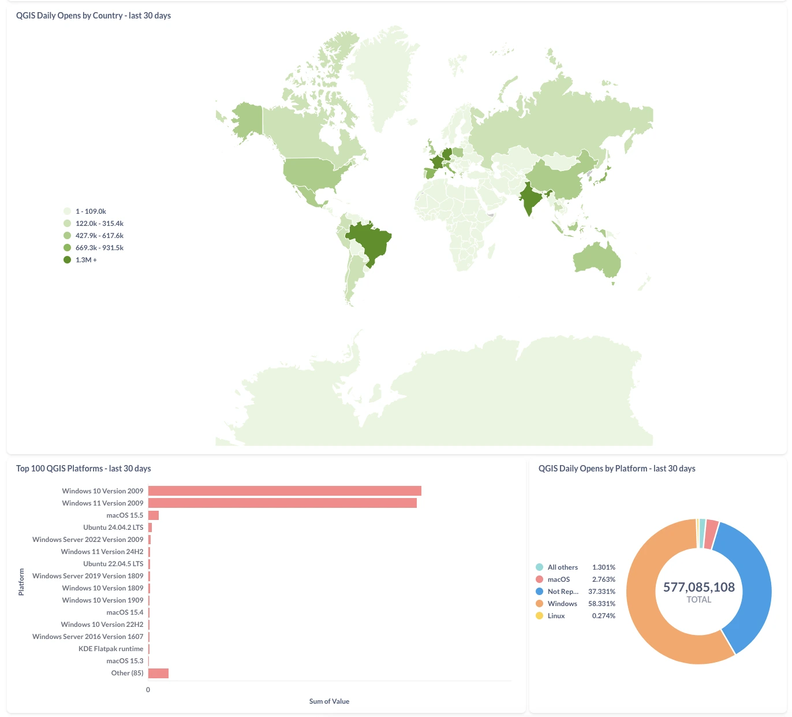
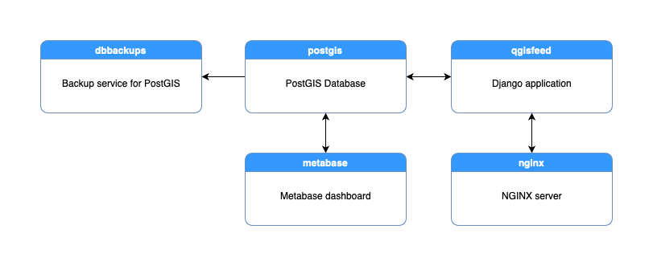
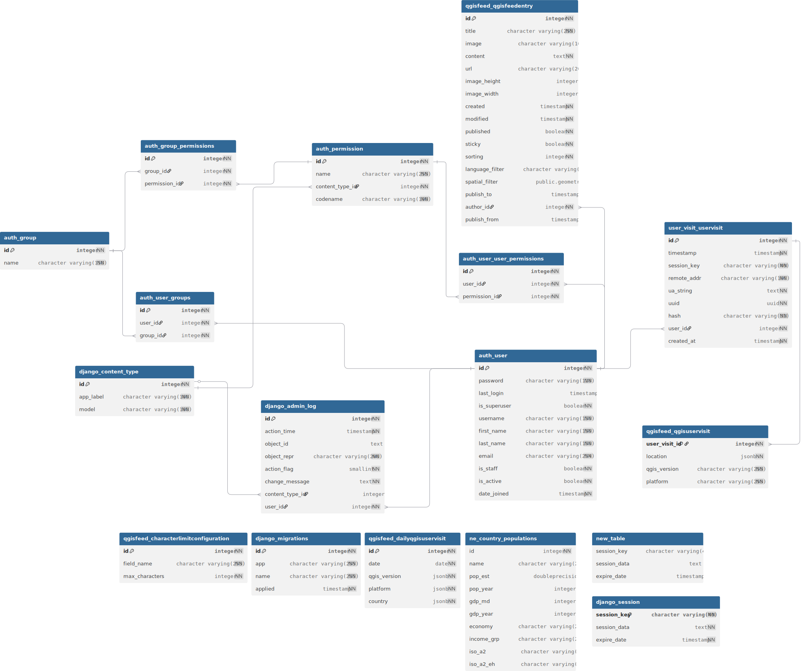

# 🌐 QGIS Home Page News Feed [](https://blog.qgis.org/2025/02/08/qgis-recognized-as-digital-public-good/)




> ## 👋 Welcome to the QGIS Home Page News Feed!
>
> **This repository hosts the source code for the website that manages and serves news for the QGIS welcome page and the QGIS Analytics Dashboard:**
>
> - 🌍 [https://feed.qgis.org](https://feed.qgis.org)
> - 🌍 [https://analytics.qgis.org](https://analytics.qgis.org)
>
> Here you'll find everything you need to **build, develop, and contribute** to these sites.
>
> ### ⚠️ Note on Other QGIS Websites
>
> **This repository is _only_ for the QGIS Home Page News Feed ([feed.qgis.org](https://feed.qgis.org)) and the QGIS Analytics Dashboard ([https://analytics.qgis.org](https://analytics.qgis.org)).**
>
> If you are looking for the source code or want to contribute to other QGIS websites, please visit their respective repositories below.
> Each website has its own codebase and contribution process:
>
> - [qgis.org](https://qgis.org) ([GitHub: QGIS-Website](https://github.com/qgis/QGIS-Website)) – QGIS Main Wesite
> - [hub.qgis.org](https://hub.qgis.org) ([GitHub: QGIS-Hub-Website](https://github.com/qgis/QGIS-Hub-Website)) – QGIS Resources Hub
> - [plugins.qgis.org](https://plugins.qgis.org) ([GitHub: QGIS-Plugins-Website](https://github.com/qgis/QGIS-Plugins-Website)) – QGIS Plugins Repository
> - [planet.qgis.org](https://planet.qgis.org) ([GitHub: QGIS-Planet-Website](https://github.com/qgis/QGIS-Planet-Website)) – QGIS Planet Blog Aggregator
> - [members.qgis.org](https://members.qgis.org) ([GitHub: QGIS-Members-Website](https://github.com/qgis/QGIS-Members-Website)) – QGIS Sustaining Members Portal
> - [certification.qgis.org](https://certification.qgis.org) ([GitHub: QGIS-Certification-Website](https://github.com/qgis/QGIS-Certification-Website)) – QGIS Certification Programme Platform
> - [changelog.qgis.org](https://changelog.qgis.org) ([GitHub: QGIS-Changelog-Website](https://github.com/qgis/QGIS-Changelog-Website)) – QGIS Changelog Manager
> - [uc2025.qgis.org](https://uc.qgis.org) ([GitHub: QGIS-UC-Website](https://github.com/qgis/QGIS-UC-Website)) – QGIS User Conference Website
>


<!-- TABLE OF CONTENTS -->
<h2 id="table-of-contents"> 📖 Table of Contents</h2>

<details open="open">
  <summary>Table of Contents</summary>
  <ol>
    <li><a href="#-project-overview"> 🚀 Project Overview </a></li>
    <li><a href="#-qgis-analytics-dashboard"> 📊 QGIS Analytics Dashboard </a></li>
    <li><a href="#-qa-status"> 🚥 QA Status </a></li>
    <li><a href="#-user-guide"> 📖 User Guide </a></li>
    <li><a href="#-license"> 📜 License </a></li>
    <li><a href="#-folder-structure"> 📂 Folder Structure </a></li>
    <li><a href="#-using-ai-large-language-models"> 🤖 Using 'AI' (Large Language Models) </a></li>
    <li><a href="#️-tech-stack"> 🛠️ Tech Stack </a></li>
    <li><a href="#️-data-model"> 🗄️ Data Model </a></li>
    <li><a href="#-using-the-nix-shell"> 🧊 Using the Nix Shell </a></li>
    <li><a href="#-contributing"> ✨ Contributing </a></li>
    <li><a href="#-have-questions"> 🙋 Have Questions? </a></li>
    <li><a href="#-contributors"> 🧑‍💻👩‍💻 Contributors </a></li>
  </ol>
</details>


## 🚀 Project Overview


## 📊 QGIS Analytics Dashboard


### 🌐 Analytics Dashboard overview

The **QGIS Analytics Dashboard** is a web-based interface that provides insights into QGIS usage statistics, including active versions and platform distribution. It is powered by [Metabase](https://www.metabase.com/) and is available at [https://analytics.qgis.org](https://analytics.qgis.org). The dashboard visualizes aggregated, anonymized data collected from QGIS clients, helping the community and developers understand trends and adoption across regions and platforms.



### 📊 How QGIS Analytics Data is Collected and Processed
<details>
  <summary><strong>How Tables Are Aggregated</strong></summary>

When a user opens QGIS, their application sends a request to `https://feed.qgis.org`. The server processes each request and extracts only three key pieces of information:

1. **Date** (rounded to the nearest day)
2. **QGIS Version** (the version code of the software)
3. **Country** (determined from the IP address, but the IP itself is not stored)
4. **Operating System** (platform string)

This information is then **aggregated hourly** into three separate tables:

- **Daily Country Table:**
  - Columns: date, country ISO code, number of hits
  - Example: `2024-06-10, DE, 1200`

- **Daily QGIS Version Table:**
  - Columns: date, QGIS version, number of hits
  - Example: `2024-06-10, 3.34.0, 800`

- **Daily Platform Table:**
  - Columns: date, OS platform, number of hits
  - Example: `2024-06-10, Windows, 900`

Each table records the **count of requests** (hits) for each unique value per day.

</details>

<details>
  <summary><strong>How User Data Is Anonymized</strong></summary>

- **No IP Addresses Stored:**
  The server uses the IP address only to determine the country. The IP is immediately discarded and never stored.

- **No Persistent Identifiers:**
  No user IDs, device IDs, or other persistent identifiers are collected or stored.

- **Aggregation:**
  Data is stored only as **counts** per day, per country/version/platform. There is no way to trace data back to an individual user.

- **Rate Limiting:**
  - Only one hit per IP per hour is counted.
  - Only one opening per day is recorded per user (even if they open/close QGIS multiple times).

</details>

<details>
  <summary><strong>Summary Table Example</strong></summary>

| Date       | Country | QGIS Version | Platform | Hits |
|------------|---------|--------------|----------|------|
| 2024-06-10 | DE      | 3.34.0       | Windows  | 120  |

</details>

<details>
  <summary><strong>Privacy Measures</strong></summary>

- **No personal or device information is stored.**
- **No sharing with third parties.**
- **Data is only used in aggregate for analytics.**

</details>

<details>
  <summary><strong>Gotchas</strong></summary>

- Users behind NAT or managed networks may be undercounted.
- Users who disable the news feed are not counted.
- Only one hit per IP per hour/day, so heavy users are not overrepresented.

</details>


## 🚥 QA Status

### 🪪 Badges
| Badge | Description |
|-------|-------------|
| [](https://github.com/qgis/QGIS-Feed-Website/actions/workflows/test.yaml) | Lint and Django Unit Tests |
| [](https://github.com/qgis/QGIS-Feed-Website/actions/workflows/build_push_image.yml) | Build and Push Docker Image to DockerHub |
|  | Website availability status |
|  | Repository license |
|  | Open issues count |
|  | Closed issues count |
|  | Open pull requests count |
|  | Closed pull requests count |


### ⭐️ Project Stars


## 📖 User Guide

<details>
    <summary><strong>Home page</strong></summary>
    </br>

A home page that displays feeds as they are rendered in QGIS is now available at the root of the web server `/`. Feeds are filterable using the filter widget on the left side. You can directly pass the filter parameters in the url according to the section **Available parameters for filters** in **Endpoint and accepted parameters**

***Note: When calling the root url from QGIS, the response data is in JSON format. See the section Response data for QGIS in the Endpoint and accepted parameters***
</details>

<details>
    <summary><strong>User Roles and Permissions</strong></summary>
    </br>

The system has three main user roles with different capabilities:

### 📝 Authors (Staff Users)
Users with the `staff` flag can:
- Create new feed entries
- Edit their own entries (including during review)
- Submit entries for review
- Add comments to their entries and respond to reviewer feedback
- View all entries and their statuses

### ✅ Reviewers (Approvers)
Users with the `qgisfeed.publish_qgisfeedentry` permission can:
- Review any entry (including their own if they're also the author)
- Approve entries (moves status to "Approved")
- Request changes from authors
- Add comments to any entry
- Publish approved entries

### 👑 Superusers
Superusers have all permissions and can:
- Do everything authors and reviewers can do
- Self-approve and publish their own entries
- Manage all system settings

**Note:** The groups `qgisfeedentry_authors` and `qgisfeedentry_approvers` are automatically created when needed.

</details>

<details>
    <summary><strong>Review Workflow</strong></summary>
    </br>

The review system works similarly to GitHub Pull Requests, enabling collaborative review and discussion:

### 📋 Workflow Steps

1. **Create Entry (Draft)**
   - Author creates a new feed entry
   - Entry starts in "Draft" status
   - Author can assign multiple reviewers

2. **Submit for Review**
   - Author clicks "Submit for Review"
   - Entry moves to "Pending Review" status
   - Assigned reviewers are notified by email
   - **Author can still edit the entry while under review**

3. **Review Process**
   - Reviewers can:
     - ✅ **Approve** - Entry moves to "Approved" status (ready to publish)
     - ⚠️ **Request Changes** - Entry moves to "Changes Requested" status
     - 💬 **Add Comment** - Provide feedback without changing status
   - **Multiple reviewers can be assigned**
   - Each reviewer's status is tracked independently
   - Authors can respond with comments at any time

4. **Addressing Feedback**
   - Author makes requested changes
   - Entry stays in review state (doesn't reset)
   - Reviewers are notified of updates
   - Review conversation continues

5. **Approval**
   - **Any one reviewer approval** moves entry to "Approved" status
   - No need to wait for all reviewers
   - Multiple approvals are visible but not required

6. **Publishing**
   - Only users with publish permission can publish
   - Authors **without** publish permission cannot publish (even their own entries)
   - Authors **with** publish permission can self-approve and publish
   - Entry moves to "Published" status and goes live

### 🔄 Status Flow

```
Draft → Pending Review → Approved → Published
           ↓
    Changes Requested → (back to Pending Review)
```

### 💬 Communication During Review

- **Review History**: All actions are visible in chronological order (oldest first)
- **Comments**: Both authors and reviewers can add comments at any time
- **Status Badges**: Visual indicators show each reviewer's current state:
  - ✅ Green: Approved
  - ⚠️ Yellow: Changes Requested
  - 💬 Blue: Comment Only
  - ⏰ Gray: Pending (not reviewed yet)

### 👥 Multi-Reviewer Support

- Multiple reviewers can be assigned to one entry
- Reviewers are visible throughout the entire workflow
- Each reviewer's status is tracked and displayed separately
- Authors can see who has approved and who is still pending

</details>

<details>
    <summary><strong>Manage feeds page</strong></summary>
    </br>

After logging in at `/accounts/login/` (accessible from the **Login** button on the **Homepage**), users can manage feed items:

- View a list of all feed items
- Sort and filter by: title, date published, author, language, review status
- Create new feed items (click "New entry" button)
- Edit existing entries (click on any item in the list)
- See entry status badges (Draft, Pending Review, Changes Requested, Approved, Published)

</details>

<details>
    <summary><strong>Feed item form</strong></summary>
    </br>

### Form Layout
- **Left side**: Edit form with all entry fields
- **Right side**: Live preview showing how it will appear in QGIS
- Changes update the preview in real-time

### Key Features

#### Reviewers Selection
- Available on both create and edit forms
- Select multiple reviewers using the dropdown
- Reviewers are notified by email when assigned

#### Reviewer Status Panel
Shows the current state of each assigned reviewer:
- Name and review status (Pending, Approved, Changes Requested)
- Timestamp of their last action
- Color-coded visual indicators

#### Content Editor
- Rich text editor with limited HTML tags: `<p>`, `<strong>`, `<em>`
- Character limit is configurable (default: 500 characters)
- Live character counter

#### Actions Available

**For Authors:**
- Save as draft
- Submit for review
- Edit during review (stays in review state)
- Add comments for reviewers

**For Reviewers:**
- Approve entry
- Request changes
- Add comments
- Publish (if approved)

**For Authors with Publish Permission:**
- All author actions
- All reviewer actions (can self-approve and publish)

### Review & Comment Section
- Visible when entry is under review, has changes requested, or is approved
- Shows all review history in chronological order
- Authors can add comments at any time
- Reviewers can approve, request changes, or comment
- Comment field is always available for both parties

</details>

<details>
    <summary><strong>Endpoint and accepted parameters</strong></summary>
    </br>

### Response data for QGIS
The application has a single endpoint available at the web server root `/` the reponse is in JSON format.

Example call: http://localhost:8000/

Returned data:
```json
[
  {
    "pk": 1,
    "title": "QGIS acquired by ESRI",
    "image": "http://localhost:8000/media/feedimages/image.png",
    "content": "<p>QGIS is finally part of the ESRI ecosystem, it has been rebranded as CrashGIS to better integrate with ESRI products line.</p>",
    "url": "https://www.qgis.com",
    "sticky": true,
    "publish_from": 1557419128
  },
  {
    "pk": 2,
    "title": "Null Island QGIS Meeting",
    "image": "",
    "content": "<p>Let's dive in the ocean together!</p>",
    "url": null,
    "sticky": false,
    "publish_from": 1557419128
  },
  {
    "pk": 3,
    "title": "QGIS Italian Meeting",
    "image": "",
    "content": "<p>Ciao from Italy!</p>",
    "url": null,
    "sticky": false,
    "publish_from": 1557419128
  }
]
```

### Available parameters for filters

The following parameters can be passed by the client to filter available records.

Parameters are validated and in case they are not valid a `Bad Request` HTTP error code `400` is returned.

#### after

When `after` is passed, only the records that have been published after the given value will be returned.

Accepted values: unix timestamp (UTC)

Example call: http://localhost:8000/?after=1557419013


#### lang

When `lang` is passed, you can specify one or more language codes as a comma-separated list. Only records with a matching `lang` or `null` `lang` will be returned; records with non-matching languages are excluded.

Accepted values: Comma-separated list of `ISO-639-1` two-letter language codes

Example call: http://localhost:8000/?lang=de,fr,it

#### lat lon (location)

When `lat` **and** `lon` are passed, the records that have a location filter set will be returned only if the point defined by `lat` and `lon` is within record's location.

Accepted values: `ESPG:4326` latitude and longitude

Example call: http://localhost:8000/?lat=44.5&lon=9.23
</details>


## 📜 License

This project is licensed under the GPL-2.0 License. See the [COPYING](./COPYING) file for details.


## 📂 Folder Structure

```plaintext
QGIS-Feed-Website/
├── 🛡️ config/                          # Nginx configuration files
├── 🖼️ img/                             # Images and media assets for this README
├── 🐍 qgisfeedproject/                 # Main Django project source code
├── 🛠️ scripts/                         # Utility and deployment scripts (eg. renew_ssl.sh)
├── 📜  COPYING                         # Project license (GPL-2.0)
├── 🐳 docker-compose-production-ssl.yml # Docker Compose config for production with SSL
├── 🐳 docker-compose-production.yml    # Docker Compose config for production
├── 🧪 docker-compose-testing.yml       # Docker Compose config for testing
├── 🛠️ docker-compose.dev.yml           # Docker Compose config for development
├── 🐳 Dockerfile                       # Main Docker build instructions
├── 🐳 Dockerfile.nginx.production      # Dockerfile for Nginx in production
├── 🐳 Dockerfile.production            # Dockerfile for production app container
├── 🧪 Dockerfile.testing               # Dockerfile for testing environment
├── 🏁 entrypoint_production.sh         # Entrypoint script for production container
├── 🏁 entrypoint_testing.sh            # Entrypoint script for testing container
├── 📝 env.template                     # Example environment variables file
├── 📖 MAKE_COMMANDS.md                 # Documentation for Makefile commands
├── 🛠️ Makefile                         # Common development and deployment commands
├── 📦 package.json                     # Node.js dependencies and scripts
├── 📖 README.md                        # Project documentation
├── 📄 REQUIREMENTS.txt                 # Python dependencies for development
├── 📄 REQUIREMENTS_PRODUCTION.txt      # Python dependencies for production
├── ⚙️ settings_docker_production.py    # Django settings for Docker production
├── ⚙️ settings_docker_testing.py       # Django settings for Docker testing
├── ❄️ shell.nix                        # Nix shell environment for development
├── 💻 vscode.sh                        # VSCode helper script for Nix shell environment
├── 📝 list-vscode-extensions.sh        # Script to list VSCode extensions for Nix shell environment
├── ⚙️ webpack.config.js                # Webpack configuration
```


## 🤖 Using 'AI' (Large Language Models)

We are fine with using LLM's and Generative Machine Learning to act as general assistants, but the following three guidelines should be followed:

1. **Repeatability:** Although we understand that repeatability is not possible generally, whenever you are verbatim using LLM or Generative Machine Learning outputs in this project, you **must** also provide the prompt that you used to generate the resource.
2. **Declaration:** Sharing the prompt above is implicit declaration that a machine learning assistant was used. If it is not obvious that a piece of work was generated, include the robot (🤖) icon next to a code snippet or text snippet.
3. **Validation:** Outputs generated by a virtual assistant should always be validated by a human and you, as contributor, take ultimate responsibility for the correct functionality of any code and the correct expression in any text or media you submit to this project.


## 🛠️ Tech Stack



This application is based on Django, written in Python and deployed on the server using docker-compose.


## 🗄️ Data Model

Below is the Entity-Relationship Diagram (ERD) illustrating the core data model for the QGIS Feed Website.
For a detailed view, click on the image below or see the full-size diagram in [erd.svg](./img/erd.svg):

[](./img/erd.svg)


## 🧊 Using the Nix Shell

Please refer to the [Nix section](./CONTRIBUTING.md#️-nix) in [CONTRIBUTING.md](./CONTRIBUTING.md).


## ✨ Contributing

We welcome contributions! Please read the [CONTRIBUTING.md](CONTRIBUTING.md) for guidelines on how to get started.


## 🙋 Have Questions?

Have questions or feedback? Feel free to open an issue or submit a Pull Request!


## 🧑‍💻👩‍💻 Contributors

- [Tim Sutton](https://github.com/timlinux) – Original author and lead maintainer of the QGIS Feed Website project
- [Kontur Team](https://www.kontur.io) – Responsible for the design of the current theme
- [Lova Andriarimalala](https://github.com/Xpirix) – Core developer and ongoing maintainer
- [QGIS Contributors](https://github.com/qgis/QGIS-Feed-Website/graphs/contributors) – See the full list of amazing contributors who have helped make this website possible.


Made with ❤️ by Tim Sutton (@timlinux), Lova Andriarimalala (@Xpirix) and QGIS Contributors.
